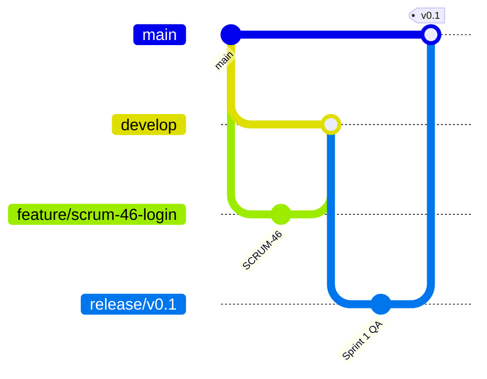

# Hệ thống Quản lý Tư vấn Thuốc — Nhóm 13

[](https://github.com/OWNER/REPOSITORY/actions/workflows/dotnet-ci.yml)

Đồ án môn **Công nghệ phần mềm** xây dựng theo quy trình **Agile Scrum**, sử dụng **ASP.NET Core MVC .NET 8**, **Entity Framework Core** và **SQL Server LocalDB**.

> Sau khi tạo repository, thay `OWNER/REPOSITORY` trong badge phía trên bằng tài khoản và tên repository GitHub thật.

## Thành viên Nhóm 13

| Thành viên | Vai trò chính |
|---|---|
| Trình Bảo Anh — 2380600085 | Product Owner, Dashboard, quản trị tài khoản, Release |
| Trần Duy Khương — 2380601115 | Scrum Master, kiểm thử, quy trình Git/CI |
| Triệu Thị Huyên — 2380600912 | Tư vấn thuốc, cảnh báo dị ứng/tồn kho |
| Dương Thị Thanh Thuý — 2380603181 | Danh mục thuốc, kho thuốc, phiếu nhập |
| Bùi Thị Lệ Quyên — 2380601869 | UI/UX Figma, in phiếu, tài liệu/demo |
| Phạm Ngọc Lợi — 2380601290 | Bệnh nhân, lịch sử tư vấn, xuất CSV |

## Chức năng chính

- Đăng nhập, đăng xuất và phân quyền theo vai trò.
- Quản lý người dùng, bệnh nhân, loại thuốc và thuốc.
- Lập phiếu nhập kho và cộng tồn bằng transaction.
- Lập phiếu tư vấn, trừ tồn và lưu lịch sử.
- Kiểm tra tồn kho, hạn dùng, trạng thái thuốc và dị ứng.
- Cảnh báo tồn thấp, sắp hết hạn và nguy cơ dị ứng.
- Dashboard dữ liệu thật, in phiếu và xuất báo cáo CSV.

## Công nghệ

- Visual Studio 2022
- .NET 8 / ASP.NET Core MVC
- Entity Framework Core 8
- Microsoft SQL Server LocalDB
- HTML, CSS, JavaScript
- Git, GitHub, GitHub Actions
- Jira, Figma, StarUML

## Cài đặt và chạy

### Yêu cầu

- Visual Studio 2022 với workload **ASP.NET and web development**.
- .NET 8 SDK.
- SQL Server LocalDB hoặc SQL Server Express.

### Cách chạy nhanh

1. Clone repository:
   ```bash
   git clone https://github.com/OWNER/REPOSITORY.git
   cd REPOSITORY
   ```
2. Mở `QuanLyTuVanThuoc_Nhom13.sln`.
3. Chọn **Build → Rebuild Solution**.
4. Nhấn `Ctrl + F5`.
5. Nếu database chưa tồn tại, ứng dụng tự tạo `QuanLyTuVanThuocDB` và dữ liệu mẫu.

Hoặc chạy `01_TAO_LAI_CSDL_VA_CHAY_WEB.bat` để tạo lại database từ script SQL rồi mở web. Lưu ý thao tác này xóa dữ liệu cũ.

### Cấu hình CSDL

| Thành phần | Giá trị |
|---|---|
| Server | `(localdb)\MSSQLLocalDB` |
| Database | `QuanLyTuVanThuocDB` |
| Connection string | `QuanLyTuVanThuoc_Nhom13/appsettings.json` |
| SQL script | `QuanLyTuVanThuoc_Nhom13/Database/Tao_CSDL_QuanLyTuVanThuocDB.sql` |

### Tài khoản demo

Mật khẩu chung: `123456`

- `admin` — Quản trị viên
- `bacsi` — Bác sĩ / Nhân viên tư vấn
- `kho` — Nhân viên kho
- `quanly` — Quản lý

## Quy trình nhánh



- `main`: phiên bản ổn định đã phát hành.
- `develop`: tích hợp các User Story đã được review và kiểm thử.
- `feature/scrum-<mã>-<tên-ngắn>`: một User Story hoặc nhiệm vụ phát triển.
- `release/v0.1`, `release/v0.2`, `release/v1.0`: kiểm thử Increment trước khi merge vào `main`.

Chi tiết: [CONTRIBUTING.md](CONTRIBUTING.md) và [docs/BRANCHING_STRATEGY.md](docs/BRANCHING_STRATEGY.md).

## Jira và GitHub

- Jira project: `https://trinhbaoanh2380600085.atlassian.net/jira/software/projects/SCRUM/summary`
- Mỗi branch, commit và Pull Request phải chứa mã `SCRUM-xx`.
- Mỗi Pull Request phải có đường dẫn Jira Issue trong phần mô tả.

Mapping 20 User Story: [docs/JIRA_GITHUB_MAPPING.md](docs/JIRA_GITHUB_MAPPING.md).

## Sprint Releases

| Sprint | GitHub Release | Nội dung |
|---|---|---|
| Sprint 1 — Nền tảng và dữ liệu | `v0.1` | Đăng nhập, bệnh nhân, loại thuốc, thuốc, giao diện cơ bản |
| Sprint 2 — Kho và tư vấn thuốc | `v0.2` | Người dùng, lịch sử, nhập kho, cảnh báo, phiếu tư vấn |
| Sprint 3 — Cảnh báo, báo cáo và phát hành | `v1.0` | Dị ứng, hạn dùng, in phiếu, Dashboard, CSV, test và tài liệu |

Release notes có sẵn trong `docs/releases/`.

## Tài liệu

- [Hướng dẫn cài đặt](INSTALLATION.md)
- [Hướng dẫn đóng góp](CONTRIBUTING.md)
- [Chiến lược nhánh](docs/BRANCHING_STRATEGY.md)
- [Mapping Jira–GitHub](docs/JIRA_GITHUB_MAPPING.md)
- [Kế hoạch Release](docs/RELEASE_PLAN.md)
- [Checklist minh chứng GitHub](docs/EVIDENCE_CHECKLIST.md)
- [ERD](docs/images/erd-quan-ly-tu-van-thuoc.png)
- [Use Case Diagram](docs/images/use-case-diagram.png)

## Lưu ý bảo mật

Không commit mật khẩu thật, token, API key hoặc connection string của môi trường production. Connection string trong dự án chỉ dùng LocalDB trên máy cá nhân.
